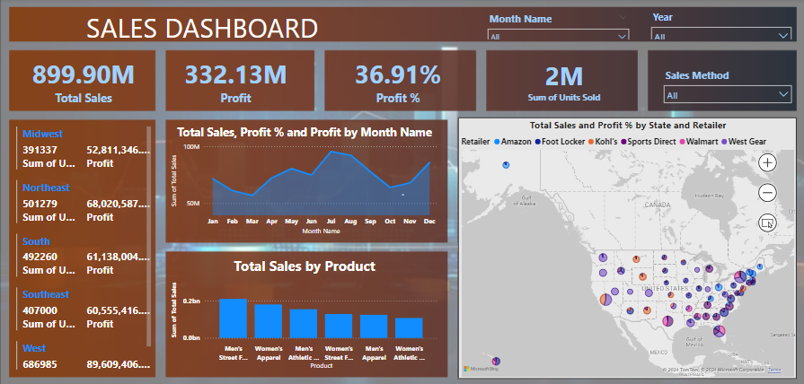

# Sales Dashboard

### **About Dataset:**

This dataset provides a comprehensive view of the sales data for a footwear and apparel retailer, with data spanning several key aspects of their business transactions. It includes information about the retailer name and ID, invoice dates, regional and local geographic details (including state and city), and detailed product descriptions. Each record in the dataset captures the price per unit, the number of units sold, total sales figures, and operating profit with its corresponding margin. Additionally, it differentiates the sales methods used, such as in-store transactions. This allows for a multi-dimensional analysis of sales performance across different regions, product types, and sales strategies over a given period, which is crucial for strategic decision-making and operational adjustments within the company

The dataset compromises the following columns: 

- **Retailer :** Name of the retail store that made the sales.
- **Retailer ID :** A unique identifier assigned to each retailer.
- **Invoice Date :** The date on which the invoice was generated for the sale.
- **Region :** The geographical region where the retailer is located.
- **State :** The state within the specified region where the sale occurred.
- **City :** The city within the state where the transaction took place.
- **Product :** Description of the product sold, categorized by type and demographic focus (e.g., Men's Street Footwear, Women's Athletic Footwear).
- **Price per Unit :** The selling price for one unit of the product.
- **Units Sold :** The number of units of the product sold in the transaction.
- **Total Sales :** The total revenue generated from the sale of the units. Calculated as the product of 'Units Sold' and 'Price per Unit'.
- **Operating Profit :** The profit made from the transaction after deducting operating expenses.
- **Operating Margin :** The ratio of operating profit to total sales, expressed as a percentage. It indicates the efficiency of the business operations.
- **Sales Method :** The channel through which the sale was made, such as in-store or possibly online (though all records provided indicate in-store).

[DataSet- Kaggle](https://www.kaggle.com/datasets/heemalichaudhari/adidas-sales-dataset)

### **KPI’s**   

In this report, I have created the following KPIs.
1. **Profit** = SUM('Data Sales Adidas'[Operational Profit])
2. **Profit %** = [Profit]/SUM('Data Sales Adidas'[Total Sales])

